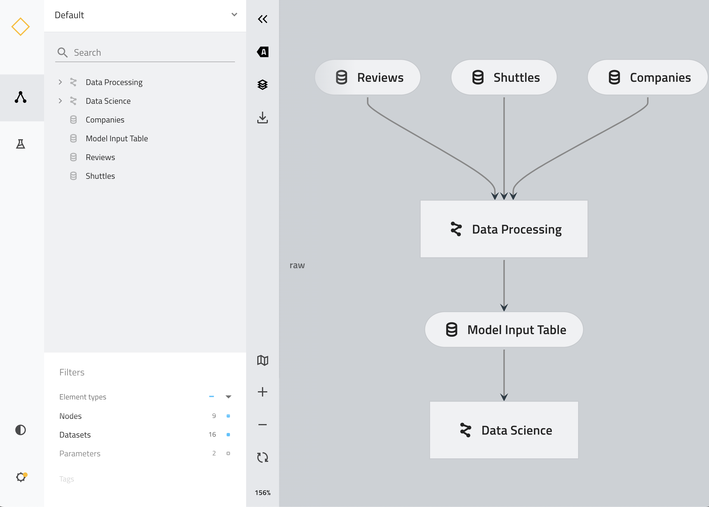

# Kedro - a framework to structure your ML pipeline

Last revision: 2023-03-27
  
Python 3.9, Kedro 0.18.4

## Description

The goal of this exercise is to create your first ML pipeline using Kedro framework.
We’ll use the spaceflights model to predict.  

From [Kedro project page](https://kedro.readthedocs.io/en/0.18.7/tutorial/spaceflights_tutorial.html):</br>
Scenario: *It is 2160 and the space tourism industry is booming. Globally, there are thousands of space shuttle companies taking tourists to the Moon and back. You have been able to source amenities offered in each space shuttle, customer reviews and company information.*

### Project

*You want to construct a model for predicting the price for each trip to the Moon and the corresponding return flight.*

## Pre-requisites

* Install your favorite code editor (i.e. [Visual Studio Code](https://code.visualstudio.com/download) or [PyCharm](https://kedro.readthedocs.io/en/stable/development/set_up_pycharm.html)). The trainer will demonstrate the exercises using Visual Studio Code.
* Download the [Python 3.9](https://www.python.org/downloads/release/python-390/) if you don’t have it already. We’ll use it as a base Python for the virtual environment.

---

## Lab scenario

### Step 1: Create and activate a virtual environment

First, prepare the virtual environment for the workshop. It allows you to use the specific version of Python and not interfere with the packages already installed on your computer.

```sh
# Create a directory for your project
mkdir workshop

# Install the virtualenv package  
pip install virtualenv 

# Create the virtualenv with the specific Python version
virtualenv workshop-env --python=python3.9  

# Activate the virtualenv
source workshop-env/bin/activate

# Go to the working directory
cd workshop
```

Now, you’re using the virtual environment:

```sh
(workshop-env) michal@MacBook-Pro-Michal workshop %
```

(optional) Deactivate conda environment

```sh
conda deactivate
```

### Step 2: Install Kedro

Note: remember to use Kedro in the specific version: `kedro==0.18.4`

```sh
# Install the Kedro Python package in the virtual environment
pip install 'kedro==0.18.4'
```

### Step 3: Create a new ML pipeline using kedro starter

In this step you’ll create your first ML pipeline. The script will ask you for some parameters. For this workshop, we’ll use the official `spaceflights` starter, which contains all the required code.

```sh
# This command will walk you through the process, and will create a directory structure and files for your project in your current path

kedro new --starter spaceflights
```

When prompted for the *Project Name* type: `spaceflights`

```text
Project Name:
=============

[Spaceflights]: spaceflights
```

And hit `Enter`.

Expected output:

```text
The project name 'spaceflights' has been applied to: 

- The project title in /Users/michal/GitHub/workshop/spaceflights/README.md 

- The folder created for your project in /Users/michal/GitHub/workshop/spaceflights 

- The project's python package in /Users/michal/GitHub/workshop/spaceflights/src/spaceflights

A best-practice setup includes initialising git and creating a virtual environment before running 'pip install -r src/requirements.txt' to install project-specific dependencies. Refer to the Kedro documentation: https://kedro.readthedocs.io/  

Change directory to the project generated in /Users/michal/GitHub/workshop/spaceflights by entering 'cd /Users/michal/GitHub/workshop/spaceflights'
```

To check if this step is completed, list the directory structure.

```sh
ls -l spaceflights
```

Expected output:

```text
total 24

-rw-r--r--   1 michal  staff  4031 Aug 30 11:24 README.md
drwxr-xr-x   5 michal  staff   160 Aug 30 11:24 conf
drwxr-xr-x  10 michal  staff   320 Aug 30 11:24 data
drwxr-xr-x   3 michal  staff    96 Aug 30 11:24 docs
drwxr-xr-x   3 michal  staff    96 Aug 30 11:24 logs
drwxr-xr-x   3 michal  staff    96 Aug 30 11:24 notebooks
-rw-r--r--   1 michal  staff   356 Aug 30 11:24 pyproject.toml
-rw-r--r--   1 michal  staff    47 Aug 30 11:24 setup.cfg
drwxr-xr-x   6 michal  staff   192 Aug 30 11:24 src
```

**Congrats!** You just created a structure for your first pipeline!

### Step 4: Install project dependencies

Please install the project dependencies, defined in the `src/requirements.txt` file.  
Note: in the future you’ll add new Python packages there.

```sh
# Make sure you’re in your project’s main folder
cd spaceflights

# Install project dependencies
pip install -r src/requirements.txt
```

Note for Mac users - if you encounter the following error:

```text
× Encountered error while trying to install package.
╰─> greenlet
```

Fix it by this command:

```sh
xcode-select --install
```

### Step 5: Walk through the code

Let’s take a look at the pipeline structure and Kedro framework concepts.
Walk through the created files (no changes needed now).
Evaluate pipeline config files, especially the [DataCatalog](https://kedro.readthedocs.io/en/stable/data/data_catalog.html)

```sh
ls -l conf/base/*

cat conf/base/catalog.yml
```

Evaluate the Kedro's [data engineering convention](https://kedro.readthedocs.io/en/stable/faq/faq.html#what-is-data-engineering-convention)

```sh
ls -l data/
```

Evaluate the pipelines definitions (Data Processing, Data Science)

```sh
ls src/spaceflights/pipelines/data_processing/*

ls src/spaceflights/pipelines/data_science/*
```

See how pipelines merge works

```sh
cat src/spaceflights/pipeline_registry.py
```

### Step 6: Visualize the pipeline

Before the actual pipeline run, you can visualize the pipeline graph (DAG) using kedro viz. [See the documentation.](https://kedro.readthedocs.io/en/stable/tutorial/visualise_pipeline.html) It’s a separate Python package, but already installed with `requirements.txt`.

Run:

```sh
kedro viz
```

Opt-out from the telemetry

```sh
Do you opt into usage analytics?  [y/N]: N
```

You should see the logs indicating that the kedro viz is running:

```sh
INFO:     Uvicorn running on <http://127.0.0.1:4141> (Press CTRL+C to quit)
```

If the browser window does not open automatically, go to the url: [http://127.0.0.1:4141](http://127.0.0.1:4141)  

Expected output:



### Step 7: Run the pipeline

Now, the pipeline is ready to run (on your local machine). Use the following command to trigger the pipeline run. This pipeline will:

* read the data from `data/01_raw` directory
* do the data preparation (`src/spaceflights/pipelines/data_processing/*`)
* train the ML model (`src/spaceflights/pipelines/data_science/*`)

```sh
# trigger run in the terminal
kedro run
```

Expected output:

```sh
                    INFO     Completed 4 out of 6 tasks                                 sequential_runner.py:85
                    INFO     Loading data from 'X_train' (MemoryDataSet)...                 data_catalog.py:343
                    INFO     Loading data from 'y_train' (MemoryDataSet)...                 data_catalog.py:343
                    INFO     Running node: train_model_node: train_model([X_train,y_train]) ->      node.py:329
                             [regressor]
                    INFO     Saving data to 'regressor' (PickleDataSet)...                  data_catalog.py:382
                    INFO     Completed 5 out of 6 tasks                                 sequential_runner.py:85
                    INFO     Loading data from 'regressor' (PickleDataSet)...               data_catalog.py:343
                    INFO     Loading data from 'X_test' (MemoryDataSet)...                  data_catalog.py:343
                    INFO     Loading data from 'y_test' (MemoryDataSet)...                  data_catalog.py:343
                    INFO     Running node: evaluate_model_node:                                     node.py:329
                             evaluate_model([regressor,X_test,y_test]) -> None
[03/24/23 11:34:12] INFO     Model has a coefficient R^2 of 0.462 on test data.                     nodes.py:55
                    INFO     Completed 6 out of 6 tasks                                 sequential_runner.py:85
                    INFO     Pipeline execution completed successfully.                            runner.py:93

```

You may evaluate outputs produced by the pipeline in `/data` directory.

### Step 8: Modify the pipeline

Now, you may customize your pipeline for your needs by adding some extra functionality.

**Add one more model accuracy metric:**

You may also log one more model accuracy metric. Please implement `Root Mean Square Error (RMSE)` in the pipeline:

```python
# in: src/spaceflights/pipelines/data_science/nodes.py
# add: mean_squared_error

from sklearn.metrics import r2_score, mean_squared_error ### Add

def evaluate_model(
    regressor: LinearRegression, X_test: pd.DataFrame, y_test: pd.Series
):
    """Calculates and logs the coefficient of determination.
    Args:
        regressor: Trained model.
        X_test: Testing data of independent features.
        y_test: Testing data for price.
    """

    y_pred = regressor.predict(X_test)
    score = r2_score(y_test, y_pred)
    rmse = mean_squared_error(y_test, y_pred, squared=False) ### Add
    
    logger = logging.getLogger(__name__)
    logger.info("Model has a coefficient R^2 of %.3f on test data.", score)
    logger.info("Model has a coefficient RMSE of %.3f on test data.", rmse) ### Add

```

### Step 9: Run the updated pipeline

```sh
kedro run
```

You'll see one more model accuracy metric in logs.

### Extra steps

1. Run built-in Jupyter Lab/IPython:
   * `kedro jupyter lab`
   * `kedro ipython`

2. Experiment with model features:
   * See: `conf/base/parameters/data_science.yml`

3. Implement the other model type:
    * See: `src/spaceflights/pipelines/data_science/nodes.py`

4. Improve your model accuracy:
   * See: `src/spaceflights/pipelines/data_science/nodes.py`

5. Setup experiment tracking:
   * [https://kedro.readthedocs.io/en/stable/tutorial/set_up_experiment_tracking.html](https://kedro.readthedocs.io/en/stable/tutorial/set_up_experiment_tracking.html)
