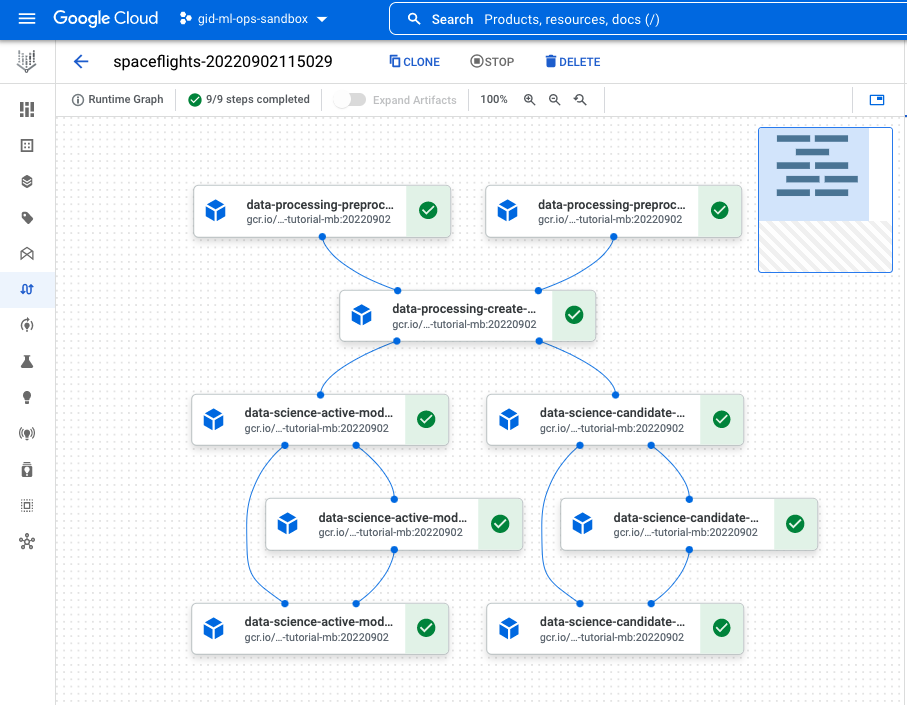

# Vertex AI Pipelines (lab)

Last revision: 2022-09-28 
Python 3.9, Kedro 0.18.2,  Kedro-VertexAI 0.7.0

See the plugin documentation:
[https://kedro-vertexai.readthedocs.io/en/0.7.0/source/02_installation/01_installation.html#kedro-setup](https://kedro-vertexai.readthedocs.io/en/0.7.0/source/02_installation/01_installation.html#kedro-setup)

## Pre-requisites:

-   A Google Cloud Platform project
-   A Google Cloud Storage bucket
-   A GCP Service Account with roles:
	- Service Account User
	- Storage Admin
	- Vertex AI Administrator
-   GCloud SDK installed
-   Docker installed


## Vertex AI (lab)
  
In this lab, you’ll prepare your Spaceflights pipeline on [Google Cloud Platform Vertex AI](https://cloud.google.com/vertex-ai).

### Step 1: Install Kedro plugins

The first step is to install required plugins.

Go to `src/requirements.txt` and add the following lines

```
kedro-vertexai==0.7.0
kedro-docker==0.3.0
```
  
Note: Be sure that you’ve got your virtual environment activated.

``` 
# Make sure you’re in your project’s main folder

cd spaceflights

# Install project dependencies
pip install -r src/requirements.txt
```

Check if the plugins were installed correctly:

```
#run this command  
kedro vertexai

Usage: kedro vertexai [OPTIONS] COMMAND [ARGS]...

  Interact with Google Cloud Platform :: Vertex AI Pipelines

Options:

  -e, --env TEXT  Environment to use.
  -h, --help      Show this message and exit.

Commands:

  compile         Translates Kedro pipeline into JSON file with VertexAI...
  init            Initializes configuration for the plugin
  list-pipelines  List deployed pipeline definitions
  run-once        Deploy pipeline as a single run within given experiment...
  schedule        Schedules recurring execution of latest version of the...
  ui              Open VertexAI Pipelines UI in new browser tab

#run this command
kedro docker

Usage: kedro docker [OPTIONS] COMMAND [ARGS]...

  Dockerize your Kedro project.


Options:

  -h, --help  Show this message and exit.


Commands:

  build    Build a Docker image for the project.
  cmd      Run arbitrary command from ARGS in the Docker container.
  dive     Run Dive analyzer of Docker image efficiency.
  init     Initialize a Dockerfile for the project.
  ipython  Run ipython in the Docker container.
  jupyter  Run jupyter notebook / lab in Docker container.
  run      Run the pipeline in the Docker container.
```

### Step 2: Prepare the Docker container

Make sure the Docker daemon is running.  
Initialize the Docker container for your pipeline
```
kedro docker init
```
Modify the `.dockerignore` file by adding the following line to include the input data inside the container.
```
# in .dockerignore
!data/01_raw
```
Update the `Dockerfile`

Change the base image to 
```
BASE_IMAGE=python:3.9-buster
```


### Step 3: Adjust DataCatalog to be compatible with VertexAI

Now, let's upadate the `DataCatalog` to be compatible with Vertex AI
  
Instructions and the example `catalog.yaml` content: [https://kedro-vertexai.readthedocs.io/en/0.6.0/source/03_getting_started/01_quickstart.html#adjusting-data-catalog-to-be-compatible-with-vertex-ai](https://kedro-vertexai.readthedocs.io/en/0.6.0/source/03_getting_started/01_quickstart.html#adjusting-data-catalog-to-be-compatible-with-vertex-ai)

You need to **replace** the whole content of `catalog.yaml` with:
```
companies:
  type: pandas.CSVDataSet
  filepath: data/01_raw/companies.csv
  layer: raw

reviews:
  type: pandas.CSVDataSet
  filepath: data/01_raw/reviews.csv
  layer: raw

shuttles:
  type: pandas.ExcelDataSet
  filepath: data/01_raw/shuttles.xlsx
  layer: raw
```
Your intermediate data will be stored in the GCS bucket set for the staging data in the `*.bin format`.
If you want to save a specific intermediate file, you need to specify a `DataCatalog` entry with the GCP path (`gs://...`)


### Step 5: Init the VertexAI pipeline definition
```
# kedro vertexai init <GCP PROJECT ID> <GCP REGION>, for example:

kedro vertexai init gid-ml-ops-sandbox europe-west1
``` 
The plugin will create `conf/base/vertexai.yaml` with the VertexAI config.


### Step 6: Adjust the `conf/base/vertexai.yaml` config
Important: here you set the Docker image name:tag you'll create in the next step.
```
# key should point to the full image name, for example 
(if you pushed the image at this name):

image: remote.repo.url.com/vertex-ai-plugin-demo:latest

# i.e. image: gcr.io/gid-ml-ops-sandbox/spaceflights-tutorial-mb:20221025

# key should point to the GCS bucket that will be used internally by  Vertex AI, for example:

root: <your_bucket_name>/<subfolder-for-vertexai>

# i.e. mb-temp/mlops-webinar-demo
```

### Step 7: Build the Docker image
 

Build the Docker image
```
docker build \
	-t gcr.io/gid-ml-ops-sandbox/spaceflights-tutorial-mb:20221025 \
	.
```
Push the Docker image to the remoe repository to allow pull it to Vertex AI
```
docker push remote.repo.url.com/spaceflights:latest

# For example
docker push gcr.io/gid-ml-ops-sandbox/spaceflights-tutorial-mb:20221025
```

### Step 8: Run the pipeline on VertexAI

Now, you can schedule your pipeline for the execution on VertexAI Pipelines

```
kedro vertexai run-once
```

Expected output:
```
See the Pipeline job here: https://console.cloud.google.com/vertex-ai/locations/europe-west1/pipelines/runs/spaceflights-20220902115029?project=gid-ml-ops-sandbox
Intermediate data datasets will be stored in
gs://mb-temp/mlops-webinar-demo/kedro-vertexai-temp/spaceflights-20220902115029/*.bin
```


