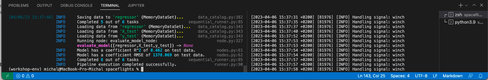
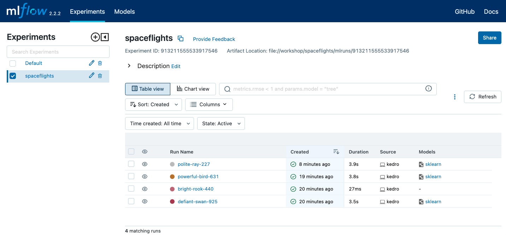

# Infrastructure for your Machine Learning platform - MLFlow
Last revision: 2023-04-06

Python 3.9, Kedro 0.18.4, Kedro-mlflow 0.11.8

## Prerequisites
-  Kedro pipeline from `lab_1`.

## Model monitoring with MLFlow
In this lab, you’ll set up the (local) infrastructure for model monitoring with MLFlow. In this tool, you can log model accuracy metrics, and track your experiments during the model development process.

From [MLFlow](https://mlflow.org/) project page:
*MLflow is an open source platform to manage the ML lifecycle, including experimentation, reproducibility, deployment, and a central model registry.*

To record data from your pipeline run in Kedro, we’ll use the kedro-mlflow plugin.

See plugin documentation: https://kedro-mlflow.readthedocs.io/en/stable/source/03_getting_started/02_first_steps.html 

## Step 1: Install plugin 

Install plugin by adding to ```src/requirements.txt```
```python
kedro-mlflow==0.11.8
```

Install required dependencies
```sh
pip install -r src/requirements.txt
```


## Step 2: Initialize MLFlow integration
Before you’ll log your metrics in MLFlow, you need to initialize it using command:
```sh
kedro mlflow init
```

By default, your metrics will be recorded in the `mlruns` directory. In the real-life scenarios, you can store it in the [database](https://www.mlflow.org/docs/latest/tracking.html) or in the cloud environment (See: [Deploying serverless MLFlow on Google Cloud Platform using Cloud Run](https://getindata.com/blog/deploying-serverless-mlflow-google-cloud-platform-using-cloud-run/))

This step will generate the `conf/local/mlflow.yaml` file.

Expected output:
```sh
'conf/local/mlflow.yml' successfully updated.
```

You can walk through the content of the file to see the available configuration options. In our case no changes are needed.

## Step 3: Log metrics 
Now, you can set the model accuracy metrics monitoring in MLFlow. To log metrics, please update the nodes definition in the data science pipeline - this is the place where your model is defined.

```python
# in src/spaceflights/pipelines/data_science/nodes.py
# add import
import mlflow

# send the metrics to the MLFlow
# add the line in bold line at the end of evaluate_model definition

logger = logging.getLogger(__name__)
logger.info("Model has a coefficient R^2 of %.3f on test data.", score)
logger.info("Model has a coefficient RMSE of %.3f on test data.", rmse)
mlflow.log_metric('r2_score', score) ### Add
```


## Step 4: (optional) Log metrics with autologging

If you want to track all available metrics, you may try mlflow autologging in sklearn models instead of logging the single metric above.

See the documentation:
https://www.mlflow.org/docs/latest/python_api/mlflow.sklearn.html 

To record the metrics with autologging, modify the `train_model` function:

```python
# in src/spaceflights/pipelines/data_science/nodes.py

regressor = LinearRegression()
    	mlflow.sklearn.autolog()
    	mlflow.end_run()  # fix if other runs are pending
    	with mlflow.start_run() as run:
          regressor.fit(X_train, y_train)
    	return regressor
```

## Step 5: Run the pipeline with model monitoring
Now, when the model monitoring setup is ready, you may run your pipeline.
Yor metrics will be recorded during the pipeline execution.
```sh
kedro run
```

Expected output:
You’ll see the new `mlruns` directory.

```sh
(workshop-env) michal@MacBook-Pro-Michal spaceflights % ls -l
total 40
-rw-r--r--   1 michal  staff  4104 25 kwi 13:55 README.md
drwxr-xr-x   5 michal  staff   160 25 kwi 13:55 conf
drwxr-xr-x  10 michal  staff   320 25 kwi 13:55 data
drwxr-xr-x   3 michal  staff    96 25 kwi 13:55 docs
-rw-r--r--   1 michal  staff  2467 25 kwi 20:18 info.log
drwxr-xr-x   6 michal  staff   192 25 kwi 13:59 logs
drwxr-xr-x   5 michal  staff   160 25 kwi 20:18 mlruns
drwxr-xr-x   3 michal  staff    96 25 kwi 13:55 notebooks
-rw-r--r--   1 michal  staff   478 25 kwi 13:55 pyproject.toml
-rw-r--r--   1 michal  staff    47 25 kwi 13:55 setup.cfg
drwxr-xr-x   6 michal  staff   192 25 kwi 13:55 src
```

Inside, you’ll find the recorded model metrics.
```
(workshop-env) michal@MacBook-Pro-Michal spaceflights % ls -l mlruns
total 0
drwxr-xr-x  3 michal  staff   96 25 kwi 20:18 0
drwxr-xr-x  7 michal  staff  224 25 kwi 20:19 1
```

## Step 5: Run MLFlow interface
To open MLFlow interface, **please open the secondary terminal**, and make sure that you're in your kedro project directory

```sh
(workshop-env) michal@MacBook-Pro-Michal spaceflights % pwd
/Users/michal/bdtw_workshop/workshop/spaceflights
```
Now, you can open the MLFlow interface:
```sh
mlflow ui
```
And open the browser window with URL:
```
http://127.0.0.1:5000/
```

Note: If you cannot connect to the UI in the browser, sometimes you need to run the interface on another port, for example:
```
mlflow ui -p 5002
```

Expected output (terminal):


Expected output (browser):

